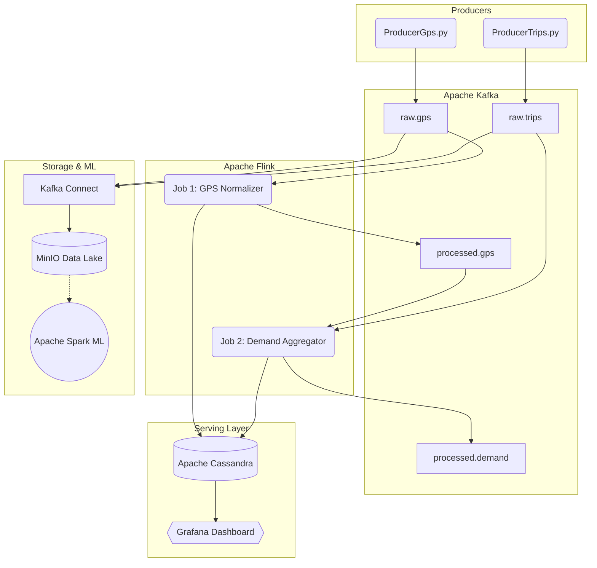

# 🚀 TaaSim Quick Start Guide (How to run the project)

Welcome to the TaaSim Data Engineering project! If you just pulled this repository for the first time, follow these exact steps to start the entire Big Data streaming architecture on your local machine.

## 🛠️ Step 1: Start the Infrastructure (Docker)
You need Docker and Docker Compose installed. Open a terminal at the root of the project and run:
```bash
docker-compose up -d
```
*This will start Kafka, Cassandra, MinIO, Spark, and Grafana in the background.*

## 🗄️ Step 2: Initialize the Database (Cassandra)
We need to create the tables that will store our real-time data. Run these two commands to inject the schema into the Cassandra container:
```bash
docker cp cassandra_schema.cql taasim-cassandra:/cassandra_schema.cql
docker exec taasim-cassandra cqlsh -f /cassandra_schema.cql
```

## 🐍 Step 3: Setup the Python Flink Environment
Apache Flink requires a specific Python environment (Python 3.8 to 3.10 is recommended). Create and activate a virtual environment, then install the dependencies:
```powershell
# Create the virtual environment
python -m venv flink_env

# Activate it (Windows)
.\flink_env\Scripts\activate

# Install PyFlink and Kafka client
pip install apache-flink==1.18.0 kafka-python
```

## 🗺️ Step 4: Generate the Simulation Data (Mapping)
Before streaming data, you need to generate the realistic GPS trajectories (teleporting Porto data to Casablanca).
1. Open the MinIO console (`http://localhost:9001` with `admin`/`password123`). Create a bucket named `raw` and upload the raw `train.csv` file into it.
2. Open **`DataClean.ipynb`** in Jupyter/VS Code and run all cells. This reads from MinIO and creates `casablanca_teleported.csv`.
3. Open a terminal and run the router script to snap coordinates to real streets (excluding highways):
```powershell
python Generate_Real_Routes.py
```
*(This generates the final `casablanca_real_roads_final.csv` needed by the producers).*

## 🚕 Step 5: Start the Data Generators (Producers)
We need to simulate the city of Casablanca! Open **two new terminals**, navigate to the project folder, and run:

**Terminal 1 (Taxis GPS):**
```powershell
python ProducerGps.py
```
**Terminal 2 (Citizen Trips):**
```powershell
python ProducerTrips.py
```
*Keep these terminals open. They will generate data infinitely.*

## ⚙️ Step 6: Start the Streaming Engines (Flink Jobs)
Now we start the "brain" of the project to process the data in real-time. Open **two new terminals**, activate the virtual environment in each, and launch the jobs:

**Terminal 3 (Job 1 - GPS Normalizer):**
```powershell
.\flink_env\Scripts\activate
python job1_gps_normalizer.py
```
*This job cleans the GPS data and maps them to the 16 zones of Casablanca.*

**Terminal 4 (Job 2 - Demand Aggregator):**
```powershell
.\flink_env\Scripts\activate
python job2_demand_aggregator.py
```
*This job calculates the supply/demand ratio per zone every 30 seconds.*

## 📊 Step 7: Visualize in Grafana
1. Open your browser: [http://localhost:3000](http://localhost:3000)
2. Login with `admin` / `admin`
3. Go to **Connections > Data sources**, add **Cassandra**.
4. Configure it: Host = `cassandra:9042`, Keyspace = `taasim`, and click **Save & test**.
5. Create a Dashboard, select the Cassandra datasource, switch visualization to **Table**, and run:
```sql
SELECT * FROM demand_zones LIMIT 100;
```
You will see the data updating in real time! 🎉

## 🗺️ TaaSim Architecture (Data Flow)
Here is the high-level Kappa-Architecture data flow of the project:


