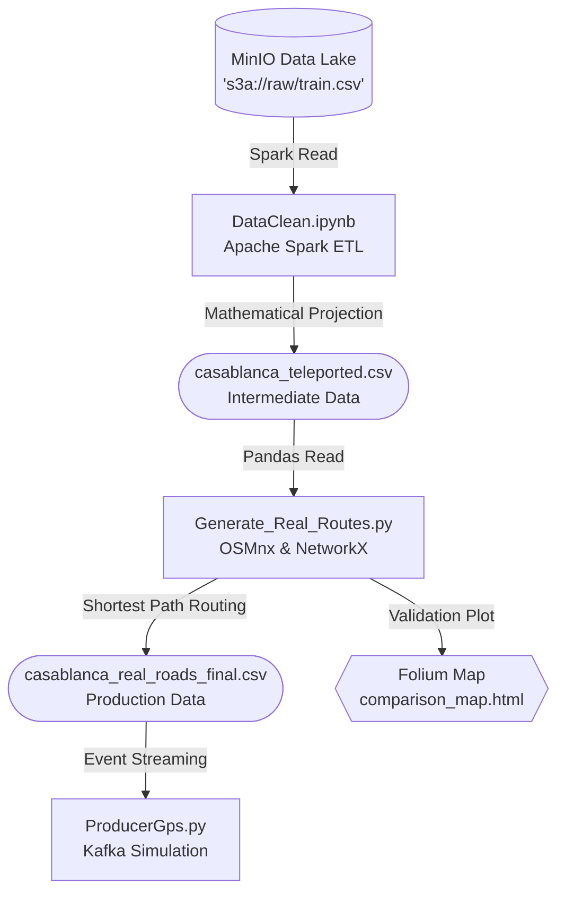

# 🗺️ Documentation of Geospatial Mapping (Porto -> Casablanca)

This document details the offline ETL process used to construct a highly realistic simulation of taxi movements in Casablanca. Due to the lack of open-source transit datasets for Casablanca, we leverage the **Porto Taxi Trajectories** dataset (1.7 million trips) and programmatically teleport, filter, and snap these trajectories to the actual Casablanca street network.

---

## 🏗️ Geospatial Data Flow Schema



---

## 📜 Detailed File Breakdown

### 1. `DataClean.ipynb` (The Teleportation Engine)
**Role:** Apache Spark Batch ETL responsible for heavy data lifting and mathematical coordinate transformation.
**Key Operations:**
- **MinIO Connection:** Connects to the local S3-compatible Data Lake (`s3a://raw/train.csv`) to read the 1.7 million raw Porto trajectories.
- **Bounding Box Projection:** Implements a custom PySpark User Defined Function (UDF) to map GPS points from Porto's geographical bounding box into Casablanca's bounding box using linear interpolation.
- **Geofencing:** Applies a strict longitude filter (`lon < -7.46`) to ensure generated trips do not leak into outer eastern suburbs (like Mohammédia or Ain Harrouda), keeping the demand strictly inside Casablanca's 16 urban zones.
- **Data Hardening:** Removes invalid records, NULL values, and empty trajectories.
- **Output:** Exports an intermediate dataset named `casablanca_teleported.csv` containing straight-line projected trajectories.

### 2. `Generate_Real_Routes.py` (The Routing Engine)
**Role:** Python script leveraging graph theory to snap mathematical straight lines to actual, drivable city streets.
**Key Operations:**
- **Graph Ingestion:** Uses the `osmnx` library to download the drivable road network of Casablanca from OpenStreetMap.
- **Highway Exclusion (Business Rule):** A strict custom filter is applied during graph download:
  ```python
  custom_filter='["highway"]["area"!~"yes"]["highway"!~"motorway|motorway_link|trunk|trunk_link"]'
  ```
  *This guarantees that simulated taxis will NEVER use highways (autoroutes) or high-speed trunk roads, forcing realistic urban traffic flow.*
- **Map Matching:** Uses `networkx` and Dijkstra's shortest path algorithm to route the taxi from its mathematical origin intersection to its mathematical destination intersection along the real street graph.
- **Output:** Generates `casablanca_real_roads_final.csv`, which contains the final, 100% realistic trajectories used by the real-time Kafka producers.

### 3. `comparison_map.html` & `casablanca_map_100_trips.html` (Validation)
**Role:** Visual QA tools generated via the `Folium` library.
- By opening these HTML files in a browser, engineers can visually verify that the generated routes perfectly hug the geometry of Casablanca's streets and successfully avoid the prohibited highways.

---

## 🚀 Execution Strategy
If you need to regenerate the simulation dataset from scratch:

1. **Upload Raw Data:** Ensure `train.csv` is uploaded to the MinIO `raw` bucket.
2. **Run Spark ETL:** Execute all cells in `DataClean.ipynb` (Expect 5-15 mins based on local JVM/Python serialization overhead).
3. **Run Router:** Execute `python Generate_Real_Routes.py` in the terminal to generate the final CSV.
4. **Start Stream:** Run `python ProducerGps.py` to stream the processed data into Kafka.
