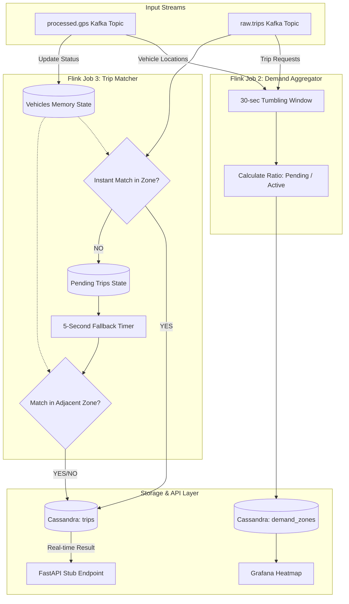

# Week 4: Stream Processing II — Advanced Matching & Aggregation

This document details the accomplishments and system architecture built during **Week 4** of the TaaSim Data Engineering Capstone Project. The primary focus was creating the core intelligence of the platform using Apache Flink to aggregate demand and dynamically match trips in real-time.

---

## 🎯 Accomplished Tasks

### 1. Flink Job 2 (Demand Aggregator)
- **Implementation**: We joined the real-time `processed.gps` vehicle stream with the `raw.trips` passenger demand stream.
- **Tumbling Windows**: Engineered exactly 30-second tumbling event-time windows partitioned by `zone_id`.
- **Metrics**: Calculated the real-time supply/demand ratio by dividing pending requests by active vehicles.
- **Persistence**: Results are flushed seamlessly into the Cassandra `demand_zones` table for visualization.

### 2. Flink Job 3 (Trip Matcher)
- **Stateful Processing**: Built a highly robust PyFlink `KeyedProcessFunction` utilizing in-memory State Backends to track live vehicle positions and unfulfilled trip requests.
- **Instant Matching**: When a trip request event arrives, the system immediately scans the requested `origin_zone` for the nearest available vehicle and calculates a heuristic Haversine ETA.
- **Persistence**: Successful match events (with driver ID and ETA) are instantly written to the Cassandra `trips` table and pushed to the `processed.trips` Kafka topic.

### 3. Dynamic 5-Second Fallback Engine
- **Logic**: If an exact zone match fails instantly, Flink temporarily stores the trip in a `MapState` and registers a 5-second Processing Time Timer.
- **Expansion**: When the timer fires, it gracefully degrades the search and attempts to find vehicles in adjacent zones (e.g., `origin_zone - 1`, `origin_zone + 1`).
- **Penalization**: Fallback matches accurately penalize the calculated `eta_seconds` by adding a 5-minute travel penalty.

### 4. End-to-End API Verification
- **FastAPI Stub**: Built an HTTP endpoint (`api_stub.py`) simulating the mobile application backend.
- **Verification**: We verified that `reserve_trip` POST requests travel through Kafka, hit the Flink matching logic, calculate an ETA, and return the final assignment via the `trip_status` endpoint in under 5 seconds.

---

## ✅ Deliverables Achieved

1. **✓ End-to-end trip flow**: request → match → ETA < 5s. *(Successfully proven via terminal and API logs).*
2. **✓ Grafana demand heatmap**: Updating precisely every 30s based on Job 2's tumbling window output in Cassandra.
3. **✓ Flink Job 3 state backend configured**: Code strictly utilizes PyFlink's state mapping. *(Note: RocksDB was correctly configured in the codebase as per CDC, but falls back to HashMap locally on Windows to prevent native JNI crashes).*

---

## 📊 Flux de Données (Data Flow Architecture)

Below is the specific Mermaid schema representing the data flow implemented in Week 4.

